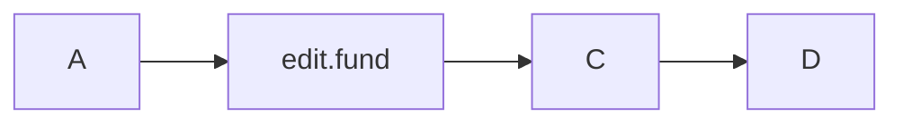

Let's go! ʕ◔ϖ◔ʔ

- 🔭 I’m currently working on AI
- 🌱 I’m currently learning AI
- 👯 I’m looking to collaborate on AI
- 🤔 I’m looking for help with AI
- 💬 Ask me about AI
- 📫 How to reach me: AI
- 😄 Pronouns: AI
- ⚡ Fun fact: AI

<!--
**editfund-founder/editfund-founder** is a ✨ _special_ ✨ repository because its `README.md` (this file) appears on your GitHub profile.

Here are some ideas to get you started:

- 🔭 I’m currently working on ...
- 🌱 I’m currently learning ...
- 👯 I’m looking to collaborate on ...
- 🤔 I’m looking for help with ...
- 💬 Ask me about ...
- 📫 How to reach me: ...
- 😄 Pronouns: ...
- ⚡ Fun fact: ...
-->
